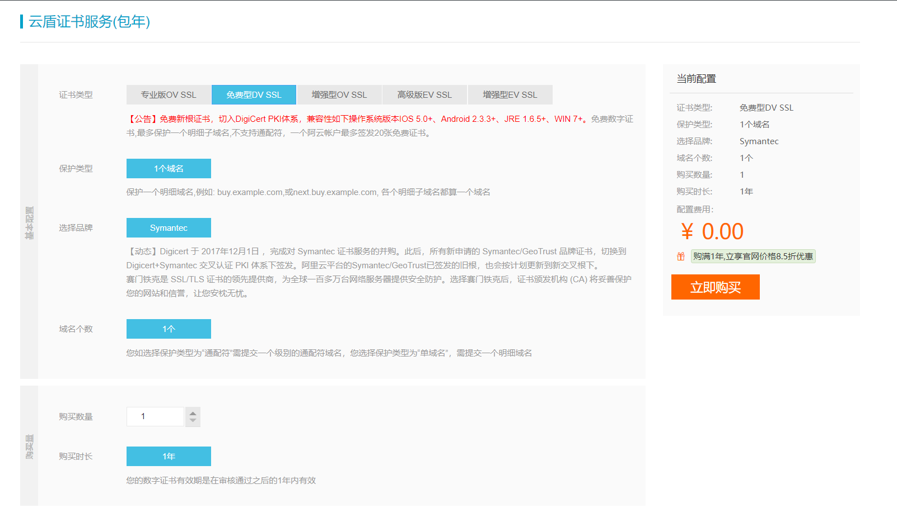
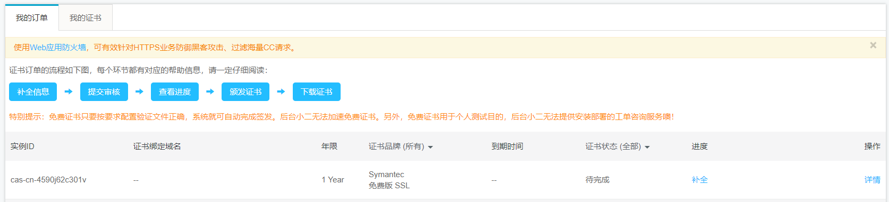
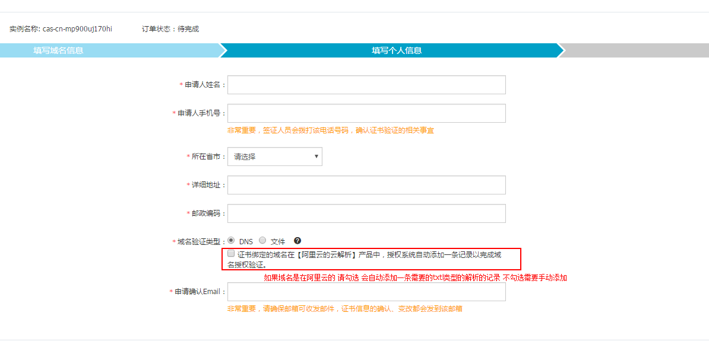

## 网站升级注意：
1. 首先需要有一个可以访问的网站域名，才可以申请ssl证书，所以先要有一个可以访问的网站
2. 申请ssl证书的方式有很多种，有的需要付费，有的则是免费的，例如：Let's Encrypt、阿里云、腾讯云、又拍云等。本文目前只说明以下方式
	1. [阿里云免费申请](#type1)
	2. [Let's Encrypt申请]()

## <a name="type1">阿里云免费申请</a>

### 一、 申请ssl证书
1. 注册阿里云账号（可用支付宝、淘宝、微博、钉钉登录）
2. 打开阿里云的控制台-》安全（云盾）-》CA证书服务（数据安全）-》购买证书
3. 阿里云将免费的证书藏的比较深，通过选择品牌Symantec-》证书类型：增强型OV SSL-》证书类型：免费型DV SSL

	注：免费数字证书,最多保护一个明细子域名,不支持通配符（即不可以通过申请一级域名证书来同时给一级域名下的二级域名进行认证），一个阿云帐户最多签发20张免费证书。
4. 点击立即购买,支付完成后（就是确定，不需要给钱），进入我的证书

5. 点击补全，填入域名及个人信息，上传相关信息等

## <a name="type2">Let's Encrypt申请</a>

### 注：参考资料

1. [阿里云免费申请](#type1)
	1. https://www.cnblogs.com/lxf1117/p/6650647.html
	2. https://zhuanlan.zhihu.com/p/29644657

2. [Let's Encrypt申请](#type2)
	1. https://zhuanlan.zhihu.com/p/24996258
	2. https://github.com/hellorocky/blog/blob/master/web/10.%E4%BD%BF%E7%94%A8letsencrypt%E5%88%B6%E4%BD%9C%E5%85%8D%E8%B4%B9https%E8%AF%81%E4%B9%A6.md
	3. https://blog.freessl.org/how-to-install-cert-in-nginx/
	4. https://zhuanlan.zhihu.com/p/31475508
	5. https://zhuanlan.zhihu.com/p/27331929
	6. https://www.codecasts.com/series/deploy-a-website-from-scratch
	7. https://zhuanlan.zhihu.com/p/29022279
	8. https://certbot.eff.org/lets-encrypt/centos6-nginx
	9. https://free.com.tw/ssl-for-free/