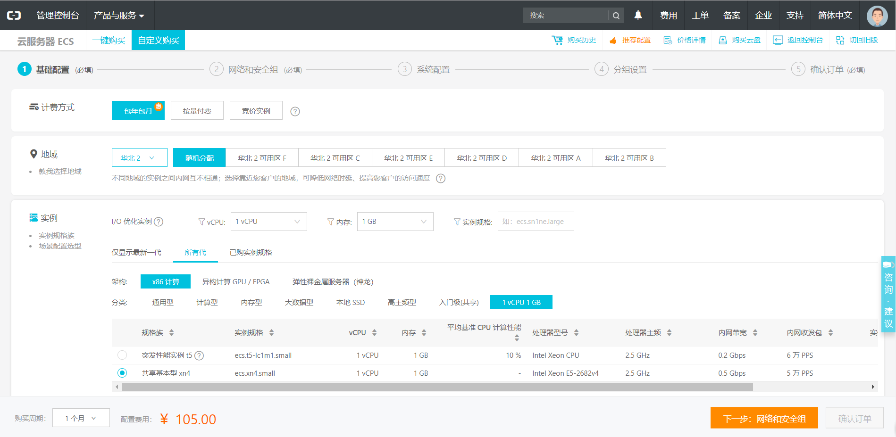
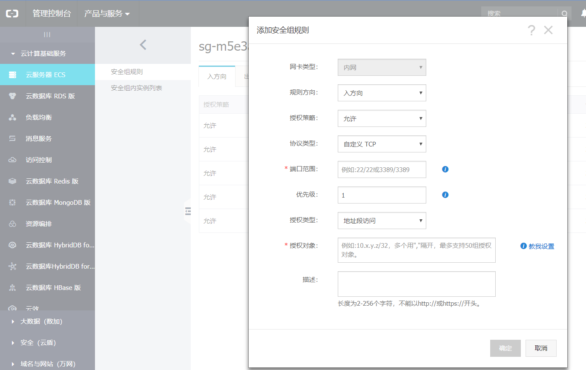

## 说明

有机会又有一台云服务器来配置环境，正好记录一下这个过程

## 服务器的购买

阿里云上购买服务器，当然还有其他很多的云服务器提供商，[ucloud](https://www.ucloud.cn/)、[vultr](https://www.vultr.com/)、[bandwagonhost](https://bwh1.net/)......

### 阿里云服务器选择

使用支付宝，淘宝，钉钉，微博账号即可登录，或者直接用手机号注册，进入[阿里云](https://www.aliyun.com)。产品中选择云服务器，基本上1vcpu，1GB，1Mb即可满足基本需求


注：如果是大学生，还可以认证云翼计划，更便宜。

### 安全组

购买之后，进入控制台，进入实例，管理界面。配置安全组。


开启22,3306,80端口

重置密码，再重启服务器即可使密码生效。

## lamp环境搭建

### 软件的安装

centos下软件的安装可以参考慕课上的教程：[linux软件安装](https://www.imooc.com/learn/447)。

1. 安装方式：
	1. rpm包安装
	2. yum安装
	3. 源码安装

### 编译安装nginx

#### 安装准备

首先由于nginx的一些模块依赖一些lib库，所以在安装nginx之前，必须先安装这些lib库，这些依赖库主要有g++、gcc、openssl-devel、pcre-devel和zlib-devel 所以执行如下命令安装

```shell
#安装 nginx 需要先将官网下载的源码进行编译，编译依赖 gcc 环境，如果没有 gcc 环境，则需要安装：
yum -y install  gcc-c++

#PCRE(Perl Compatible Regular Expressions) 是一个Perl库，包括 perl 兼容的正则表达式库。nginx 的 http 模块使用 pcre 来解析正则表达式，所以需要在 linux 上安装 pcre 库，pcre-devel 是使用 pcre 开发的一个二次开发库。nginx也需要此库。命令：
yum -y install pcre pcre-devel 

#zlib 库提供了很多种压缩和解压缩的方式， nginx 使用 zlib 对 http 包的内容进行 gzip ，所以需要在 Centos 上安装 zlib 库。 
yum -y install zlib zlib-devel

#OpenSSL 是一个强大的安全套接字层密码库，囊括主要的密码算法、常用的密钥和证书封装管理功能及 SSL 协议，并提供丰富的应用程序供测试或其它目的使用。
nginx 不仅支持 http 协议，还支持 https（即在ssl协议上传输http），所以需要在 Centos 安装 OpenSSL 库。
yum -y install openssl openssl-devel  
```

#### 安装nginx

##### 源码安装

1. 安装前检查一下是否安装了nginx
```
find -name nginx
```

2. 如果安装了nginx，就卸载掉
```
yum remove nginx
```

3. 进入/usr/local目录(可选项，可以直接在/root下下载)
```
cd /usr/local 
```

4. 从[官网下载](https://nginx.org/en/download.html)最新版的stable version nginx
```
wget http://nginx.org/download/nginx-1.12.2.tar.gz 
```

5. 解压nginx压缩包
```
tar -zxvf nginx-1.12.2.tar.gz 
```

6. 会产生一个nginx-1.12.2 目录，这时进入nginx-1.12.2目录
```
cd  nginx-1.12.2 
```

7. 接下来安装，使用--prefix参数指定nginx安装的目录,make、make install安装
```
./configure --prefix=/usr/local/nginx --with-http_ssl_module --with-pcre --with-http_gzip_static_module --without-http_gzip_module --with-http_stub_status_module
#添加ssl模块，方便配置https
#默认安装在/usr/local/nginx  
make 
make install
```

8. 如果没有报错，顺利完成后，最好看一下nginx的安装目录
```
whereis nginx
```
安装完毕后，进入安装后目录（/usr/local/nginx）便可以启动或停止它了。

9. 启动、停止nginx
```
cd /usr/local/nginx/sbin/
./nginx 
./nginx -s stop
./nginx -s quit
./nginx -s reload
./nginx -s quit:此方式停止步骤是待nginx进程处理任务完毕进行停止。
./nginx -s stop:此方式相当于先查出nginx进程id再使用kill命令强制杀掉进程。
/usr/local/nginx/sbin/nginx -v  查看版本
/usr/local/nginx/sbin/nginx -t  测试配置文件是否正常
pkill nginx  强制关闭
```

10. 查询nginx进程：
```
ps aux|grep nginx
```

11. 重启 nginx
	1. 先停止再启动（推荐）：
对 nginx 进行重启相当于先停止再启动，即先执行停止命令再执行启动命令。如下：
```
./nginx -s quit
./nginx
```
	2.重新加载配置文件：
当 ngin x的配置文件 nginx.conf 修改后，要想让配置生效需要重启 nginx，使用-s reload不用先停止 ngin x再启动 nginx 即可将配置信息在 nginx 中生效，如下：
```
./nginx -s reload
```

###### 添加Nginx到系统服务

1. 创建nginx启动命令脚本
```
vi /etc/init.d/nginx
```

2. 插入以下内容, 注意修改PATH和NAME字段, 匹配自己的安装路径 
```
#! /bin/bash
# chkconfig: - 85 15
PATH=/usr/local/nginx
DESC="nginx daemon"
NAME=nginx
DAEMON=$PATH/sbin/$NAME
CONFIGFILE=$PATH/conf/$NAME.conf
PIDFILE=$PATH/logs/$NAME.pid
SCRIPTNAME=/etc/init.d/$NAME
set -e
[ -x "$DAEMON" ] || exit 0
do_start() {
$DAEMON -c $CONFIGFILE || echo -n "nginx already running"
}
do_stop() {
$DAEMON -s stop || echo -n "nginx not running"
}
do_reload() {
$DAEMON -s reload || echo -n "nginx can't reload"
}
case "$1" in
start)
echo -n "Starting $DESC: $NAME"
do_start
echo "."
;;
stop)
echo -n "Stopping $DESC: $NAME"
do_stop
echo "."
;;
reload|graceful)
echo -n "Reloading $DESC configuration..."
do_reload
echo "."
;;
restart)
echo -n "Restarting $DESC: $NAME"
do_stop
do_start
echo "."
;;
*)
echo "Usage: $SCRIPTNAME {start|stop|reload|restart}" >&2
exit 3
;;
esac
exit 0
```

3. 设置执行权限
```
chmod a+x /etc/init.d/nginx
```

4. 注册成服务
```
chkconfig --add nginx
```

5. 设置开机启动
```
chkconfig nginx on
```

6. 重启, 查看nginx服务是否自动启动
```
shutdown -h 0 -r
netstat -apn|grep nginx
```

7. 对nginx服务执行停止/启动/重新读取配置文件操作
```
#启动nginx服务
systemctl start nginx.service
#停止nginx服务
systemctl stop nginx.service
#重启nginx服务
systemctl restart nginx.service
#重新读取nginx配置(这个最常用, 不用停止nginx服务就能使修改的配置生效)
systemctl reload nginx.service
```

### yum源安装

```
#安装nginx
yum install -y nginx
#设置nginx开机启动
chkconfig nginx on
#启动nginx
service nginx start
```

## 安装php

### 编译安装php

1. 进入PHP[官网下载](http://php.net/get/php-7.2.3.tar.gz/from/a/mirror)压缩包。
```
cd /root & wget -O php7.tar.gz http://cn2.php.net/get/php-7.2.3.tar.gz/from/this/mirror
```

2. 解压源码包
```
tar -xvf php7.tar.gz
```

3. 进入目录
```
cd php-7.2.3
```

4. 安装php依赖
```
yum install libxml2 libxml2-devel openssl openssl-devel bzip2 bzip2-devel libcurl libcurl-devel libjpeg libjpeg-devel libpng libpng-devel freetype freetype-devel gmp gmp-devel libmcrypt libmcrypt-devel readline readline-devel libxslt libxslt-devel
```

5. 编译配置
```
$ ./configure \
--prefix=/usr/local/php \
--with-config-file-path=/etc \
--enable-fpm \
--with-fpm-user=nginx  \
--with-fpm-group=nginx \
--enable-inline-optimization \
--disable-debug \
--disable-rpath \
--enable-shared  \
--enable-soap \
--with-libxml-dir \
--with-xmlrpc \
--with-openssl \
--with-mcrypt \
--with-mhash \
--with-pcre-regex \
--with-sqlite3 \
--with-zlib \
--enable-bcmath \
--with-iconv \
--with-bz2 \
--enable-calendar \
--with-curl \
--with-cdb \
--enable-dom \
--enable-exif \
--enable-fileinfo \
--enable-filter \
--with-pcre-dir \
--enable-ftp \
--with-gd \
--with-openssl-dir \
--with-jpeg-dir \
--with-png-dir \
--with-zlib-dir  \
--with-freetype-dir \
--enable-gd-native-ttf \
--enable-gd-jis-conv \
--with-gettext \
--with-gmp \
--with-mhash \
--enable-json \
--enable-mbstring \
--enable-mbregex \
--enable-mbregex-backtrack \
--with-libmbfl \
--with-onig \
--enable-pdo \
--with-mysqli=mysqlnd \
--with-pdo-mysql=mysqlnd \
--with-zlib-dir \
--with-pdo-sqlite \
--with-readline \
--enable-session \
--enable-shmop \
--enable-simplexml \
--enable-sockets  \
--enable-sysvmsg \
--enable-sysvsem \
--enable-sysvshm \
--enable-wddx \
--with-libxml-dir \
--with-xsl \
--enable-zip \
--enable-mysqlnd-compression-support \
--with-pear \
--enable-opcache
```

6. 编译安装
```
make && make install
```

7. 添加 PHP 命令到环境变量
```
vim /etc/profile
```

8. 在末尾加入
```
PATH=$PATH:/usr/local/php/bin
export PATH
```

要使改动立即生效执行
```
./etc/profile
或 
$ source /etc/profile
```
查看环境变量
```
echo $PATH
```
查看php版本
```
php -v
```

9. 配置php-fpm
```
$ cp php.ini-production /etc/php.ini
$ cp /usr/local/php/etc/php-fpm.conf.default /usr/local/php/etc/php-fpm.conf
$ cp /usr/local/php/etc/php-fpm.d/www.conf.default /usr/local/php/etc/php-fpm.d/www.conf
$ cp sapi/fpm/init.d.php-fpm /etc/init.d/php-fpm
$ chmod +x /etc/init.d/php-fpm
```

10. 启动php-fpm
```
$ /etc/init.d/php-fpm start
```

### rpm包安装php

```
yum -y install php lighttpd-fastcgi php-cli php-mysql php-gd php-imap php-ldap php-odbc php-pear php-xml php-xmlrpc php-mbstring php-mcrypt php-mssql php-snmp php-soap  
//安装php和所需组件使PHP支持MySQL、FastCGI模式  
yum -y install  php-tidy php-common php-devel php-fpm php-mysql  
systemctl restart php-fpm.service
```

## 安装mysql

1. 安装mysql源
```
yum localinstall  http://dev.mysql.com/get/mysql57-community-release-el7-7.noarch.rpm
```

2. 安装mysql
```
yum install mysql-community-server
```

	确认一下mysql的版本，有时可能会提示mysql5.6

3. 安装mysql的开发包，以后会有用
```
yum install mysql-community-devel
```

4. 启动mysql
```
service mysqld start
```
	Redirecting to /bin/systemctl start  mysqld.service

5. 开机启动
```
systemctl enable mysqld 
systemctl daemon-reload
```

6. 查看mysql启动状态
```
service mysqld status
```
	出现pid

	证明启动成功

7. 获取mysql默认生成的密码
```
grep 'temporary password' /var/log/mysqld.log
```
	2015-12-05T05:41:09.104758Z 1 [Note] A temporary password is generated for root@localhost: %G1Rgns!dD!v</str></str>

	加粗的就是生成的密码

8. 换成自己的密码
```
mysql -uroot -p
```
	Enter password:输入上面的密码

	成功输入后进入一下步，这里你估计会输入 好几次才进去

9. 更换密码
```
mysql>  ALTER USER 'root'@'localhost' IDENTIFIED BY 'MyNewPass4!';
```

	这个密码一定要足够复杂，不然会不让你改，提示密码不合法;

10. 退出mysql;
```
mysql> quit;
```

11. 用新密码再登录，试一下新密码
```
mysql -uroot -p
```

	Enter password:输入你的新密码

12. 确认密码正确后，退出mysql;
```
mysql> quit;
```

13. 设置root用户可以远程访问
```
GRANT ALL PRIVILEGES ON *.* TO 'root'@'%' IDENTIFIED BY 'Chen123456.' WITH GRANT OPTION;
```
	Chen123456改成设置的密码

## nginx配置php

1. 查看nginx的配置
```
cd /usr/local/nginx/conf/nginx.conf
```

2. 按“i”编辑文件在最后的“}”加入如下代码
```
include conf.d/*.conf;
```

3. 新建conf.d/website.conf文件进行配置
```
[root@localhost conf]# vim conf.d/website.conf

server{
    listen 80;
    server_name  localhost;#网站域名，没有就是localhost
    root /var/www/html; # 该项要修改为你准备存放相关网页的路径
    location / {
        index  index.php index.html index.htm;
         #如果请求既不是一个文件，也不是一个目录，则执行一下重写规则
         if (!-e $request_filename)
         {
            #地址作为将参数rewrite到index.php上。
            rewrite ^/(.*)$ /index.php/$1;
            #若是子目录则使用下面这句，将subdir改成目录名称即可。
            #rewrite ^/subdir/(.*)$ /subdir/index.php/$1;
         }
    }
    #proxy the php scripts to php-fpm
    location ~ \.php {
            include fastcgi_params;
            ##pathinfo支持start
            #定义变量 $path_info ，用于存放pathinfo信息
            set $path_info "";
            #定义变量 $real_script_name，用于存放真实地址
            set $real_script_name $fastcgi_script_name;
            #如果地址与引号内的正则表达式匹配
            if ($fastcgi_script_name ~ "^(.+?\.php)(/.+)$") {
                    #将文件地址赋值给变量 $real_script_name
                    set $real_script_name $1;
                    #将文件地址后的参数赋值给变量 $path_info
                    set $path_info $2;
            }
            #配置fastcgi的一些参数
            fastcgi_param SCRIPT_FILENAME $document_root$real_script_name;
            fastcgi_param SCRIPT_NAME $real_script_name;
            fastcgi_param PATH_INFO $path_info;
            ###pathinfo支持end
        fastcgi_intercept_errors on;
        fastcgi_pass   127.0.0.1:9000;
    }
    
    location ^~ /data/runtime {
	return 404;
    }
	
    location ^~ /application {
	return 404;
    }
	
    location ^~ /simplewind {
	return 404;
    }
}
```


